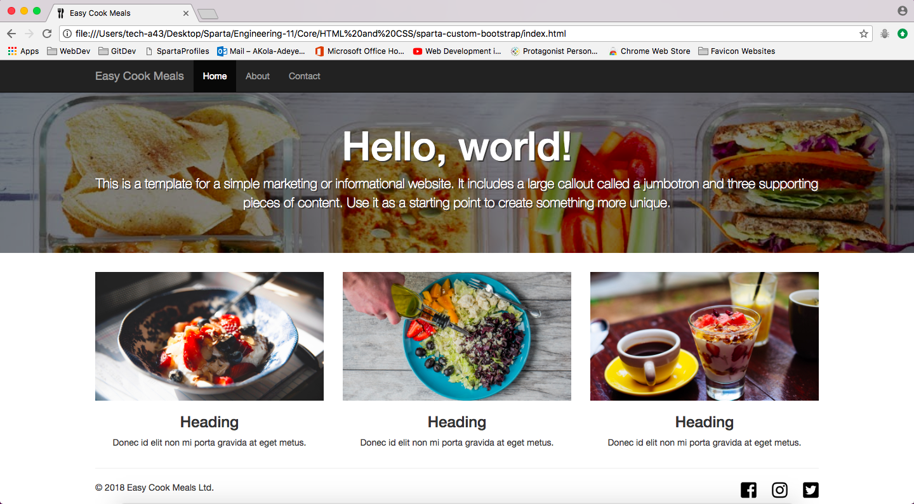

# <p align="center">Sparta Custom Bootstrap Project</p>
<hr>
#### Group Task (in pairs):

To create a 3 page website using Bootstrap about a topic of our own choice.

#### It must have:
* Consistency and must look 'stylish'
* Wireframe and plan first, before coding
* At least 3 Pages
* Consistent Colour Scheme

#### Top Tips:

* Can use coolors.co to create colour scheme
* Agree on each page before doing ANY coding
* Get the core of the site finished as a pair before working seperately
* Plan out a File structure, Git branch structure, and how you will be interacting with GitHub/your group member

Presenting Tomorrow Morning - **24th May 9:30am**
<hr>

# <p align="center">Our Website - Easy Cook Meals</p>

**Description** - This website presents easy cook meal solutions for people with a busy schedule/those without the time to cook a standard meal.

**GitHub URL:** 
[https://github.com/ACKAdeyemi/sparta-custom-bootstrap](https://github.com/ACKAdeyemi/sparta-custom-bootstrap)

**How to Download** - click 'clone or download' button, download a zip of our project, unzip, open the index.html and enjoy.

#### Challenges:
* We got lucky that we were able to communicate face-2-face, comms remotely would have made confirmations and discussions more difficult, adding to time taken to complete the project.
* We worked really well together as we discussed our ideas equally, listened to each other well, we planned effectively at beginning and we paid attention to the project scope and time
* We could have tried to add more features to make things a bit more exciting – mainly the features that we discussed earlier
* Textarea for 'Message' box on Contact page doesn't allow the user to resize even though the CSS states **“resize: both;”**  - we also tried input[type=textarea]{resize:vertical} and it still didn't work

Code Snippet of our Message Box on our contact page:

```html
<!-- HTML CODE-->
<div class="form-inputs col-lg-9 col-md-9 col-sm-9 col-xs-9">
	<input class="message-textbox" type="textarea" placeholder="Hi there...">
</div>
```

```css
/* CSS CODE */
.message-textbox {
  resize:both;
}
```
<hr>

# <p align="center">index/Home page screenshot</p>

